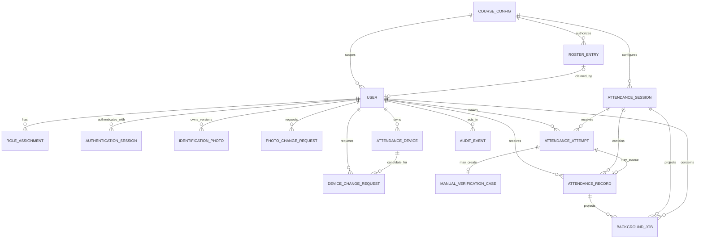

# Domain Model

## What the domain model means

The domain model is the shared business vocabulary and rule set for the product. It sits between the text-first mockup and the implementation:

- The mockup says what users see, what they can attempt, and how outcomes are explained.
- The domain model says which business objects exist, how they relate, and which rules can never be violated.
- The API contract exposes safe commands and queries over that model.
- The database schema and code implement the model, but do not define product policy independently.

This is a logical model, not a final Drizzle schema. PostgreSQL tables may combine or normalize supporting records differently as long as every concept and invariant remains representable.

## Bounded areas

The initial system should keep clear boundaries around:

1. Identity and account recovery.
2. Roles and authorization.
3. Participant profile and private identification photos.
4. Attendance-device recognition and replacement.
5. Attendance-session lifecycle.
6. Attendance attempts, geofence decisions, and final records.
7. Manual verification.
8. Audit history.
9. Google Sheets projection and background jobs.
10. Course configuration, retention, and operations.

## Conceptual relationship map

## Core entities

### CourseConfig

Represents the protected configuration for the initial course deployment.

Key information:

- Course label and status.
- Explicit IANA timezone, initially `Africa/Lagos`.
- Venue latitude and longitude.
- Configurable geofence radius (initially 200 m), automatic-acceptance accuracy threshold (initially 150 m), clearly-remote boundary (initially 500 m), 30-second reading freshness, and 10-second acquisition timeout.
- Three-hour default session duration, manual-case 15-minute post-close grace period, session extension policy, and Admin-only reopening policy.
- Google workbook identifier and synchronization settings.
- Configurable photo retention of course end plus approximately 90 days, indefinite attendance/audit retention, rate-limit thresholds, and other operational policies.
- A monotonic configuration `version` used to prevent an Administrator from overwriting a concurrent change. Planned onboarding rate-limit overrides are time-bounded and auditable.

There is one initial course deployment. The model may retain a course identifier to avoid hard-coding global state, but enterprise multi-tenancy is outside MVP scope.

### RosterEntry

Represents an Administrator-imported authorization to register for the course.

Key information:

- Canonical unique serial number, expected normalized name, email and/or phone, and `enrollmentEffectiveDate`.
- `UNCLAIMED`, `CLAIMED`, or `DISABLED` status, claim timestamp, and linked user when claimed.
- Import batch, correction/disable actor, reason, and timestamps.

Ordinary registration must atomically match and claim one eligible `UNCLAIMED` entry. Duplicate or disputed claims require Administrator handling. A first-claim-only pilot mode is exceptional, explicitly configured, and requires Administrator review for every claim.

### User

Represents an authenticated account.

Key information:

- Stable internal identifier.
- Full name, unique normalized phone, unique normalized email, and Argon2id password hash.
- Optional participant serial number in canonical `KSA-XX` form.
- Account status, registration timestamp, and nullable email-verification timestamp.

Public registration creates a Participant only after roster matching. It queues a Resend verification email, authenticates the participant, and does not block attendance while email remains unverified. Only verified email can support self-service password recovery. A bootstrap Administrator may exist without a participant serial or attendance eligibility.

### AuthenticationSession

Represents one revocable server-managed login session.

Key information:

- User, one-way token hash, creation, last-use, idle-expiry, absolute-expiry, and revocation data.
- Safe device/network context for security review without storing the raw cookie.

The host-only `Secure`, `HttpOnly`, `SameSite=Lax` session cookie renews on use, expires after 30 days of inactivity, and has a 90-day absolute maximum. It is distinct from the attendance-device credential. Password reset, suspected compromise, and other account-security actions revoke affected sessions.

### RoleAssignment

Represents an active or historical assignment of `PARTICIPANT`, `COURSE_REP`, or `ADMIN`.

Key information:

- User, role, status, assigned/revoked timestamps, and actor.
- Reason or structured context for privileged changes.

The single active Course Representative and minimum-one-Administrator rules must be enforced safely under concurrent updates.

### IdentificationPhoto

Represents a private, versioned participant image used only for human identity verification.

Key information:

- User, randomized private storage key, safe media metadata, checksum, version, and status.
- Upload and approval/replacement metadata.
- Retention and deletion timestamps.

Uploads are limited to 8 MB, resized to a maximum 1600 px longest edge, re-encoded as JPEG quality 85, and stripped of EXIF. The final object is private in Cloudflare R2. Original filenames, EXIF data, and public URLs are not authoritative fields; authorized reads use only a few-minute presigned URL.

### PhotoChangeRequest

Represents a participant request to replace the identification photo used as the manual-verification identity anchor.

Key information:

- Participant, private candidate photo/version, request state, request time, and optional note.
- Administrator reviewer, decision time, and mandatory decision reason.

Only an Administrator may approve a replacement. Approval activates the processed candidate version, retains auditable version history, and schedules the superseded photo for deletion under the configured retention policy.

### AttendanceDevice

Represents an approved browser/device installation using a server-issued random credential. It does not represent an immutable physical phone identity.

Key information:

- User, token hash or protected reference, `ACTIVE`/`REVOKED` status.
- First-seen, approval, revocation, and minimal non-invasive metadata.

Only one device may be active for a participant. The separate device cookie has no independent time expiry; it remains valid until device-replacement approval or an account-security action revokes it. Authentication and attendance-device recognition are separate concerns.

### DeviceChangeRequest

Represents a status-tracked request to activate a candidate attendance device.

Key information:

- Requesting user, candidate device, request context, state, reviewer, decision time, and reason.
- Monotonic request version used to prevent stale review decisions.

Approval must atomically activate the candidate and revoke the prior active device.

### AttendanceSession

Represents one actual physical class event, not a calendar Wednesday.

Key information:

- Course, local attendance date, original and current effective start/end instants, and lifecycle state.
- Monotonic version, reopen count, and extension/cancellation/reopen timestamps used for safe concurrent commands.
- Creator/opener/closer and timestamps.
- Cancellation and reopening metadata.

Scheduled sessions are inert until server time reaches their effective start. Only an effective open session accepts attendance. A Course Representative may extend an open session to a future time on the same local calendar day, capped at two hours beyond the original end; only an Administrator may exceed that cap. Only an Administrator may reopen or cancel a closed session. Cancelled sessions never enter attendance denominators.

### AttendanceAttempt

Represents an evaluated check-in attempt, successful or not.

Key information:

- Participant, session if one is effective, attendance device reference, server receipt time, and result code.
- Location outcome, distance rounded to the nearest 25 m, reported accuracy, and policy version. Raw latitude/longitude is computed against the venue in-request and immediately discarded.
- Idempotency/correlation identifiers.

An attempt provides support, manual-review, and abuse-analysis context without becoming a final attendance record by itself. Fixes older than 30 seconds are discarded. With the initial configuration: accuracy up to 150 m and distance up to 200 m passes; accuracy up to 150 m and distance beyond 500 m clearly rejects; all other readings are uncertain. No fix within 10 seconds, denied permission, unavailable, or unsupported location is routed to an explicit manual request rather than automatic rejection.

### ManualVerificationCase

Represents a human-review workflow caused by uncertain automatic verification or an explicitly controlled emergency flow.

Key information:

- Participant, session, source attempt, creation source (`AUTOMATIC_UNCERTAIN`, `PARTICIPANT_REQUEST`, or `EMERGENCY`), reason code, participant reason, status, reviewer, decision reason, request timestamp, and expiry at session close plus 15 minutes.

Only a technically uncertain outcome auto-creates a case. Clearly remote and denied/unavailable/no-fix outcomes require the participant to request review explicitly. Session/device/duplicate failures never create a case. Approval creates or returns the single final attendance record with method `MANUAL`; it cannot bypass attendance uniqueness. After expiry, only Administrator historical correction is allowed.

### AttendanceRecord

Represents the authoritative final presence of one participant at one session.

Key information:

- Session, participant, status, method, server check-in time, source attempt, and optional approver.
- Current corrected state and correction metadata where applicable.

The database must enforce one logical record per `(session_id, participant_id)`. Repeated or concurrent submissions return the existing result.

Historical correction updates the current record/state and writes an immutable `AuditEvent` containing before/after values, actor, reason, and timestamp; there is no separate versioned-attendance table. Absence is a reporting outcome for an applicable participant with no present record in a closed, non-cancelled session. Sessions before the roster entry's `enrollmentEffectiveDate` are explicit `NOT_APPLICABLE`/`N/A`, excluded from the denominator. Absence is not created merely because a Wednesday passed.

### AuditEvent

Represents an append-oriented record of security-significant and privileged behavior.

Key information:

- Actor and actor-role context.
- Action, target type/ID, timestamp, reason, before/after structured data, and request correlation ID.

Audit metadata must be sanitized. Raw passwords, authentication/device tokens, and unnecessary exact coordinates are prohibited.

### BackgroundJob / SheetSyncJob

Represents durable PostgreSQL-backed work for Sheets projection, Resend email, scheduled activation/closure, notifications, and retention tasks. A Sheets job projects the Master Register, dated session tabs, and Summary.

Key information:

- Stable source entity/operation key, status, attempt count, next attempt, last sanitized error, and timestamps.

Jobs run in a separate worker through pg-boss or Graphile Worker; Redis is not part of MVP. Jobs must be idempotent and reconstructable from authoritative database state. Retry immediately, then after seconds, approximately 1, 5, and 15 minutes, and then every 30–60 minutes with jitter until success or visible Administrator escalation.

## Non-negotiable invariants

- One final attendance record per participant and session.
- At most one active attendance device per participant.
- At most one effective/open session for the initial course.
- Exactly one active Course Representative unless policy explicitly changes.
- At least one active Administrator.
- Only server time determines authoritative timestamps and attendance-window validity.
- Public registration grants only Participant.
- Ordinary registration requires and claims an approved roster entry.
- Serial, email, and normalized phone are unique; participant serial follows canonical `KSA-XX` and is not self-editable.
- Device replacement revokes the old credential as part of the same consistency boundary.
- Google Sheets never determines whether attendance exists.
- Cancelled sessions and non-session Wednesdays never create absence.
- Course Representative cannot self-approve device replacement or manual attendance exception.
- Privileged changes preserve actor, target, time, reason where required, and before/after context.
- Attendance and audit records are retained indefinitely; exact coordinates are never persisted; private photos follow their shorter retention policy.

## Transactional boundaries

The following operations require a database transaction or an equivalent atomic consistency mechanism:

- Final check-in insert plus duplicate handling and critical audit/outbox state.
- Manual approval plus attendance creation and audit event.
- Device replacement approval plus old-device revocation, new-device activation, request decision, and audit event.
- Role change plus enforcement of one Course Representative and at least one Administrator.
- Session open plus enforcement of one effective/open session.
- Roster claim plus Participant creation, initial role, initial device, and outbox work.
- Open-session extension/reopen plus policy validation and audit.
- Historical correction plus before/after audit and projection job.

Google Sheets calls must occur after these transactions commit. A transactional outbox or another durable enqueue mechanism is preferred so committed changes are not lost between database commit and job creation.

## Suggested domain events

These names are conceptual and may become outbox events, audit actions, or both:

- `ParticipantRegistered`
- `RosterImported`
- `RosterEntryClaimed`
- `EmailVerificationRequested`
- `EmailVerified`
- `IdentificationPhotoReplaced`
- `IdentificationPhotoReplacementRequested`
- `AttendanceDeviceRegistered`
- `DeviceChangeRequested`
- `DeviceReplacementApproved`
- `AttendanceSessionOpened`
- `AttendanceSessionClosed`
- `AttendanceSessionExtended`
- `AttendanceSessionCancelled`
- `AttendanceSessionReopened`
- `AttendanceAttemptEvaluated`
- `ManualVerificationRequested`
- `ManualVerificationApproved`
- `ManualVerificationRejected`
- `AttendanceRecorded`
- `AttendanceHistoricallyCorrected`
- `RoleAssignmentChanged`
- `CourseConfigurationChanged`
- `SheetProjectionRequested`

## Reporting applicability

`RosterEntry.enrollmentEffectiveDate` determines when a participant enters attendance denominators. Every earlier real session is represented as `NOT_APPLICABLE` in application history and `N/A` in the Summary tab. Cancelled sessions keep a clearly marked dated Sheet tab for auditability but are excluded from every denominator.
