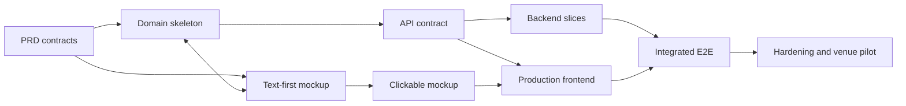

# General Implementation Plan

## Objective

Deliver a secure, mobile-first KSA Attendance System with three working areas:

- `/mockup` validates screens, content, states, and responsive flows using static data.
- `/backend` owns authentication, authorization, business rules, persistence, private files, audit, and Google Sheets projection.
- `/frontend` is the production user interface built from the approved mockup and API contract.

The application database is authoritative. The permanent QR is a public route, and all attendance decisions occur on the backend.

## Approved repository shape and stack

```text
/
├── context/
│   └── KSA_Attendance_System_PRD_v1.0.pdf
├── docs/
│   ├── README.md
│   ├── permissions-matrix.md
│   ├── domain-model.md
│   ├── state-machines.md
│   ├── api-contract.yaml
│   ├── security-rules.md
│   ├── error-behavior.md
│   ├── acceptance-tests.md
│   ├── open-decisions.md
│   └── general-implementation-plan.md
├── mockup/
│   ├── README.md
│   ├── screens.md
│   ├── index.html
│   ├── styles.css
│   └── mockup.js
├── backend/
│   └── NestJS + TypeScript + Drizzle project
├── frontend/
│   └── Next.js + TypeScript + Tailwind project
└── README.md
```

PostgreSQL is authoritative. The production topology uses separate frontend, backend, worker, and managed PostgreSQL services on Render Frankfurt, private Cloudflare R2 storage, Resend email, sanitized Sentry tracking, and one custom origin that routes `/api/*` to the backend.

## Delivery strategy

Build in vertical, testable slices. Mockup work and backend domain/API design overlap, but the production frontend begins only after the relevant mockup flow and API contract are stable enough to consume.



## Phase 0 — Decision and contract gate

**Status:** Complete. Product and architecture decisions were approved in the September 2026 review and reconciled across the contracts before scaffolding.

### Work

- Review the PRD and documentation set with the product owner.
- Adopt the approved foundation decisions in `open-decisions.md`: Next.js, NestJS, PostgreSQL/Drizzle, server sessions, private R2, PostgreSQL-backed jobs, Render, Resend, and Sentry.
- Adopt the approved registration, roster, photo, timezone, session, geofence, manual-review, reporting, retention, and rate-limit policies.
- Confirm the domain vocabulary, state transitions, permission matrix, API naming, and error codes.
- Create architecture decision records for material choices.

### Deliverables

- Approved and documented stack.
- Root project README and local-development prerequisites.
- Updated open-decision statuses/ADRs.
- API contract version `0.1` accepted as the implementation baseline.

### Exit gate

No unresolved decision blocks registration, authentication, storage, session, or deployment foundations.

## Phase 1 — Text-first and clickable mockup

**Status:** Complete. The screen specification and static responsive prototype are approved for the next implementation slice.

### Work

- Review every screen in `mockup/screens.md` for purpose, content, primary action, states, copy, role, and transition.
- Build a low-fidelity responsive prototype using static fixtures and a reviewer-only scenario selector.
- Cover Participant, Course Rep, and Administrator workflows.
- Demonstrate all attendance outcomes, manual verification, device replacement, role/configuration, audit, and Sheets-health states.
- Review at 320 px mobile, common phone width, tablet, and desktop.
- Perform an initial accessibility review of headings, labels, focus, status communication, and touch targets.
- Check the core flows against the WCAG 2.2 AA target.

### Deliverables

- Approved text-first screen specification.
- Clickable static mockup with no production secrets or real participant data.
- Recorded copy/navigation/state decisions reflected in the domain and API documents.

### Exit gate

Stakeholders can complete the core journeys without unresolved navigation, copy, role, or responsive-state questions.

## Phase 2 — Backend foundation

**Status:** Complete (2026-09-03). The backend foundation and local PostgreSQL migration/bootstrap verification passed; see [`phase-2-verification.md`](phase-2-verification.md).

### Work

- Scaffold `/backend` with NestJS and TypeScript, formatter, linter, type checks, and test framework.
- Configure development, test, staging, and production environment boundaries.
- Connect PostgreSQL through Drizzle and establish reviewed migration discipline.
- Implement structured errors, correlation IDs, sanitized logging, health checks, and configuration validation.
- Establish hashed server sessions (30-day idle/90-day absolute), separate persistent attendance-device cookies, same-origin CSRF/origin controls, DEC-036 rate limits, and security headers.
- Establish private Cloudflare R2 and PostgreSQL-backed queue interfaces, initially with test adapters; the worker is a separate process and Redis is excluded.
- Implement a secure one-time bootstrap-Administrator command/process.
- Generate OpenAPI through `@nestjs/swagger` and validate it against this implementation baseline.
- Add sanitized Sentry instrumentation with replay disabled, Render-compatible health checks, worker heartbeat/backlog health, and sensitive-field filtering.

### Deliverables

- Reproducible local backend setup.
- Test database and migration commands.
- CI checks for format, lint, type/static analysis, tests, and secret scanning where selected.
- Health endpoint and safe error envelope.
- Sanitized environment example.
- NestJS runtime with generated Swagger/OpenAPI foundation.
- Drizzle domain-skeleton schema with reviewed initial migration and database constraints.
- Hashed login-session and separate attendance-device credential services.
- PostgreSQL-backed durable job port/adapter and private-storage port with memory/R2 adapters.
- One-time, non-public Administrator bootstrap command.

### Exit gate

The service can start from documented steps, migrate a blank test database, run CI checks, and bootstrap an Administrator without public registration.

## Phase 3 — Identity, registration, roles, and private photos

**Status:** Complete (2026-09-03 for the backend vertical slice). See [`phase-3-verification.md`](phase-3-verification.md). The production frontend, Resend worker delivery, device-replacement workflow, and attendance/session workflows remain later phases.

### Work

- Implement User, RoleAssignment, hashed AuthenticationSession, recovery, and verification persistence.
- Implement Admin CSV `RosterEntry` import/correction/disable, claim/dispute handling, and `enrollmentEffectiveDate`.
- Implement participant registration against an eligible unclaimed roster entry and normalize name, unique phone, email, and exact `KSA-XX` serial.
- Enforce unique normalized email, phone, and serial; keep the pilot first-claim mode explicit and Admin-reviewed.
- Hash passwords with Argon2id. Queue Resend verification email; do not gate attendance on verification and allow self-service recovery only for verified email.
- Enforce the 8 MB photo limit; decode safely, resize to 1600 px longest edge, re-encode JPEG quality 85, strip EXIF, and store under a randomized private R2 key.
- Register the current browser as the participant's first active attendance device.
- Authenticate after registration and preserve check-in return intent.
- Implement backend authorization policies and immediate role revocation.
- Implement Admin Course Rep assignment and Administrator grant/revoke with final-Admin protection.
- Implement participant photo-change requests and Admin-only approval with protected version history and retention work.
- Append required audit events.

### Tests/gate

- AT-001, AT-002, AT-014, AT-015, and AT-017 pass at applicable layers.
- Object-ID tampering and role escalation return no protected data.

## Phase 4 — Session and automatic attendance core

**Status:** Complete (2026-09-03). The session/configuration/check-in slice and its local end-to-end verification are documented in [`phase-4-verification.md`](phase-4-verification.md). Manual verification requests and device replacement are delivered in Phase 5; Sheets provider delivery remains Phase 6 work.

### Work

- Implement CourseConfig with `Africa/Lagos`, three-hour session default, 200 m radius, 150 m maximum automatic accuracy, 500 m clearly-remote boundary, 30-second freshness, 10-second acquisition timeout, 15-minute manual grace, retention, and configurable rate limits.
- Implement session create/schedule/automatic-activate/open/close/extend/cancel/Admin-reopen transitions.
- Enforce Course Rep same-day/two-hour open-session extension and no Course Rep closed-session reopen/cancel.
- Enforce one effective/open session and valid start/end using server time.
- Implement reliable automatic closure with `SYSTEM` attribution.
- Implement stable participant attendance context and check-in API.
- Implement independent attendance-device recognition.
- Implement fresh location evaluation: discard older-than-30-second fixes; pass reliable readings through 200 m; clearly reject reliable readings beyond 500 m; classify every other reading as uncertain; route no-fix/denied/unavailable/unsupported to explicit manual request.
- Implement AttendanceAttempt and transactional final AttendanceRecord.
- Enforce unique `(session_id, participant_id)` and map races/retries to the existing result.
- Use atomic PostgreSQL-backed queue/outbox work rather than Google calls in attendance transactions.

### Tests/gate

- Core evidence for AT-003, AT-004, AT-005, AT-009, AT-010, and AT-016 passes; the AT-011 reporting/denominator projection is completed with the Phase 6 Sheets/reporting slice.
- Check-in success cannot precede database commit.
- Multiple backend processes do not depend on in-memory correctness state.

## Phase 5 — Manual verification, device replacement, and operations

**Status:** Complete (2026-09-03). The manual-review, device-replacement, operational-search, attendance-history, expiry-worker, and historical-correction slice is documented in [`phase-5-verification.md`](phase-5-verification.md).

### Work

- Auto-create and deduplicate manual cases only for `UNCERTAIN`; implement explicit participant requests for denied/unavailable/no-fix/clearly-remote outcomes and forbid cases for inactive/duplicate/device failures.
- Implement case list/detail/approve/reject and expiry at session close plus 15 minutes, after which only Admin correction applies.
- Implement safe, idempotent manual attendance creation with method and approver attribution.
- Implement emergency manual attendance within allowed operational windows.
- Implement candidate device requests, protected-photo review, atomic replacement, and device history.
- Prevent Course Rep self-approval and stale/double decisions.
- Implement operational dashboard queries, participant search, polling-based live attendance, persistent queue counts, and session history.
- Implement Administrator historical corrections against current attendance state with mandatory reason and before/after `AuditEvent`; do not create a separate attendance-version table.

### Tests/gate

- AT-006, AT-007, AT-008, AT-013, and relevant AT-014 cases pass in automated checks and local API/worker smoke verification.
- Old device fails immediately after replacement approval.
- Manual and automatic paths share the same database uniqueness guarantee.

## Phase 6 — Google Sheets projection

**Status:** Implementation complete (2026-09-03). The durable projection worker, reporting rules, Admin health/retry/reconciliation API, local memory provider, and credential-swappable Google Sheets provider are delivered. Production workbook/credential validation remains part of deployment hardening.

### Work

- Implement pg-boss or Graphile Worker consumption on PostgreSQL; do not introduce Redis.
- Project Master Register, one `YYYY-MM-DD` tab per real session, and Summary.
- Project `N/A` before roster enrollment effective date and exclude it from percentages.
- Keep a clearly marked `CANCELLED` dated tab and exclude it from Summary denominators.
- Use stable identifiers and idempotent upserts.
- Authenticate with a dedicated least-privilege Google Cloud service account shared only to the target Sheet; keep credentials swappable for Kora handoff without code changes.
- Implement immediate/seconds/~1m/5m/15m/30–60m-with-jitter retry, safe error capture, backlog health, Admin retry, and reconciliation/rebuild.
- Ensure prohibited sensitive fields never reach Sheets.
- Test manual Sheet damage/deletion and quota/outage recovery.

### Tests/gate

- AT-012 and AT-018 pass.
- A committed attendance remains successful throughout a Google outage.
- Repeating jobs or full reconciliation produces one logical projection.
- Local verification uses the memory provider; production verification must use a Kora-approved workbook and least-privilege service account.

## Phase 7 — Production frontend

**Status:** Core implementation complete (2026-09-03). See [`phase-7-verification.md`](phase-7-verification.md). Browser-level E2E coverage, production credentials, deployment, and the full accessibility/performance release review remain hardening work.

### Work

- Scaffold `/frontend` with Next.js, TypeScript, Tailwind, and an API client generated or typed from the accepted OpenAPI contract.
- Implement the approved mockup screen-by-screen using real backend states.
- Implement shared auth, Participant, Course Rep, and Administrator navigation.
- Request fresh browser geolocation only during check-in and translate browser failures to stable backend/UI outcomes.
- Implement loading, empty, error, retry, stale-state, and responsive transformations.
- Keep authorization-aware visibility while treating backend denial as authoritative.
- Add browser-level automated tests with geolocation and network mocking.

### Exit gate

The production frontend matches approved flows, consumes documented APIs, and passes the acceptance scenarios without reproducing business rules as client authority.

## Phase 8 — Security, privacy, reliability, and accessibility hardening

**Status:** In progress (2026-09-03). Local security, privacy, email, Sentry, origin, frontend-header, and photo-retention hardening is implemented and verified in [`phase-8-verification.md`](phase-8-verification.md). The remaining release gate requires an explicit course-end retention input, staging deployment, real-provider checks, accessibility/device evidence, and pilot evidence.

### Work

- Perform threat modeling and verify current framework/OWASP guidance for the approved stack.
- Verify HTTPS, cookies, CSRF/origin behavior, CORS, CSP/headers, redirects, rate limits, session rotation, and safe errors in a production-like environment.
- Verify private photo access, retention, backup sensitivity, and deletion tasks.
- Verify audit completeness and absence of secrets/coordinates in logs and Sheets.
- Verify sanitized Sentry error tracking with session replay disabled plus Render logs/health checks, job alerts, database/storage health, backup automation, and restore drills.
- Verify course-end-plus-90-day photo deletion and indefinite attendance/audit retention without retaining raw coordinates.
- Test keyboard, screen reader/status announcements, contrast, zoom/large text, reduced motion, and touch targets.
- Run performance checks on ordinary mobile-network conditions and control frontend bundle/image costs.

### Exit gate

The security release gate in `security-rules.md` and all applicable non-functional acceptance evidence are complete.

## Phase 9 — Staging, venue pilot, and release

**Status:** Gate 1 preparation in progress (2026-09-03). The staging-only Render Blueprint is prepared and locally parsed; Render workspace synchronization and provider configuration have not started. Follow the one-gate-at-a-time release sequence in [`phase-9-release-plan.md`](phase-9-release-plan.md).

Phase 9 is split into three gates so real-participant testing never begins before a controlled staging environment has passed the required checks.

### Gate 1 — Staging

- Deploy separate frontend, backend, worker, and managed PostgreSQL staging services on Render Frankfurt.
- Configure separate private storage, test email, test Google workbook, Sentry, HTTPS, same-origin `/api/*` routing, and secrets.
- Run the acceptance, security, accessibility, device, backup/restore, outage/retry, and operator checks.
- Approve the controlled pilot only after staging evidence is recorded.

### Gate 2 — Venue pilot

- Deploy staging/pilot with synthetic or explicitly approved pilot data.
- Test real venue GPS on representative Android and iPhone devices.
- Tune geofence and accuracy configuration from evidence.
- Rehearse Course Rep absence, lost device, manual verification, Sheets outage, session cancellation/reopen, backup restoration, and Administrator recovery.
- Train operational users and document support procedures.
- Confirm the approved retention implementation, remaining risks, rollback/forward-fix plan, and launch ownership.

### Gate 3 — Production release

- Complete the production configuration and data checklist.
- Configure Kora-approved production providers and service-account ownership.
- Confirm backups, restore, monitoring, support, rollback, and the explicit course-end retention input.
- Obtain written go-live approval and monitor the initial launch window.

### Exit gate

Staging and pilot evidence pass; production checklist and go-live approval are complete; pilot issues are resolved or explicitly accepted with owners; production operations and recovery are documented.

## Parallel work map

| Track                 | Can start                      | Depends on                        | Produces                                                  |
| --------------------- | ------------------------------ | --------------------------------- | --------------------------------------------------------- |
| Text-first mockup     | Immediately                    | PRD/domain skeleton               | Approved screen behavior and copy                         |
| Clickable mockup      | After first text review        | Screen spec                       | UX validation artifact                                    |
| Backend foundation    | After contract reconciliation  | Approved foundation decisions     | Running NestJS service, PostgreSQL/Drizzle, CI, auth base |
| Domain/API refinement | Immediately and ongoing        | PRD + mockup feedback             | Stable implementation contract                            |
| Production frontend   | Per stable vertical slice      | Mockup + API + backend endpoint   | Real role-based UI                                        |
| Sheets projection     | After authoritative data flows | Users, sessions, attendance, jobs | Human-readable workbook                                   |
| Hardening/pilot       | Throughout, final gate late    | Integrated product                | Release evidence                                          |

## Traceability rule

Every implemented feature should identify:

- Relevant PRD section and `MUST`/`SHOULD`/`MAY` level.
- Domain entities/invariants affected.
- API endpoint and stable outcomes affected.
- Mockup/production screens affected.
- Automated and manual acceptance evidence.
- Security, privacy, audit, migration, and operational impact.

## Definition of done for a vertical slice

A slice is complete only when:

- Backend validation and deny-by-default authorization are implemented.
- Database constraints/migrations preserve relevant invariants.
- Critical state changes are transactional and audited.
- API documentation and mockup/frontend states agree.
- Loading, empty, error, retry, mobile, and accessibility behavior is handled.
- Unit/integration/contract/E2E tests appropriate to the boundary pass.
- No secret, private photo, exact location, or prohibited data leaks to logs, responses, fixtures, or Sheets.
- Configuration and operational behavior are documented.

## Initial execution order

The first practical work package after this decision-adoption pass should be:

1. Approve the reconciled `mockup/screens.md` and OpenAPI baseline.
2. Build the clickable static mockup.
3. Scaffold the NestJS backend and PostgreSQL/Drizzle CI/database foundation.
4. Deliver registration/authentication/roles as the first integrated vertical slice.
5. Deliver session plus automatic check-in as the second slice.

This order validates product understanding early while establishing the authoritative backend foundations needed by every later screen.
