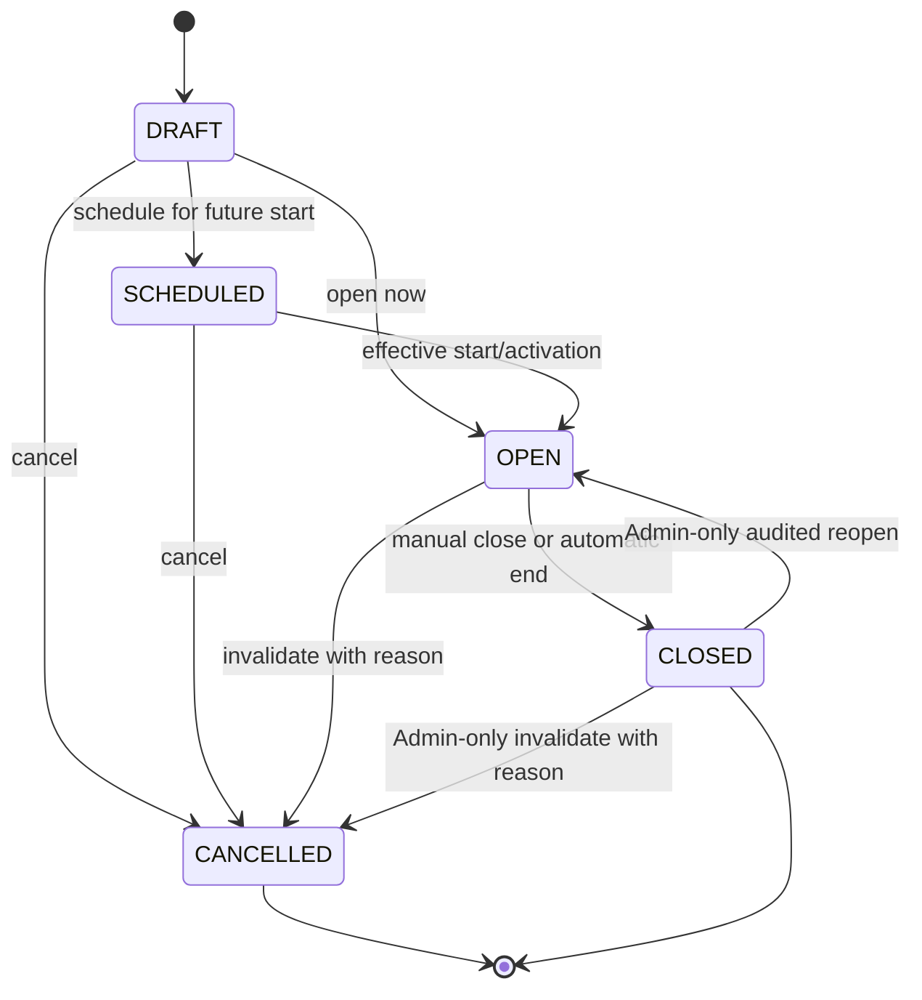
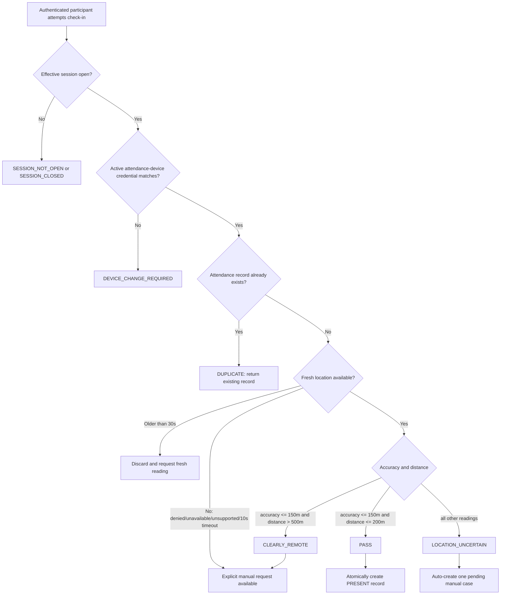
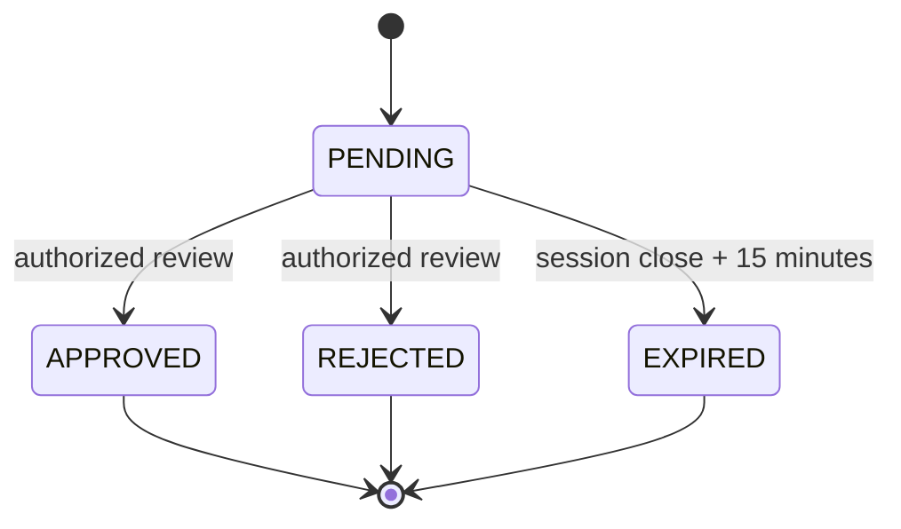
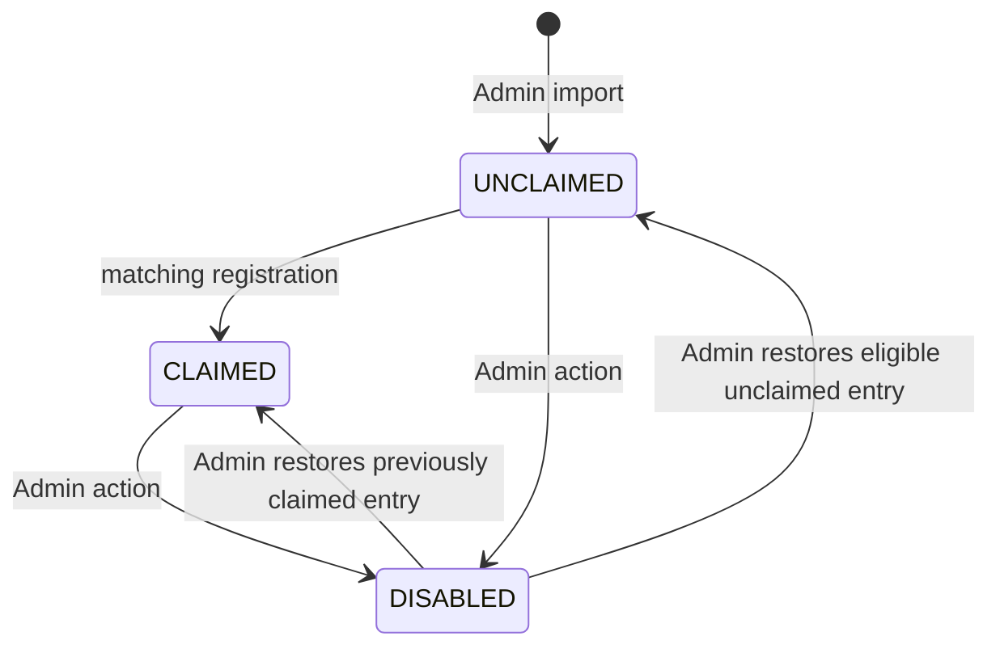
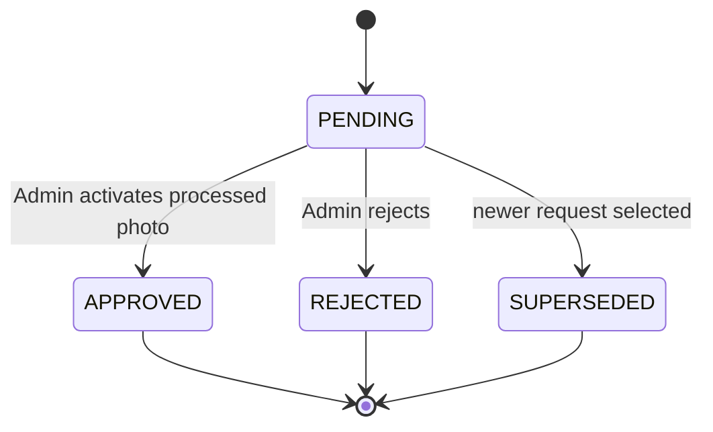
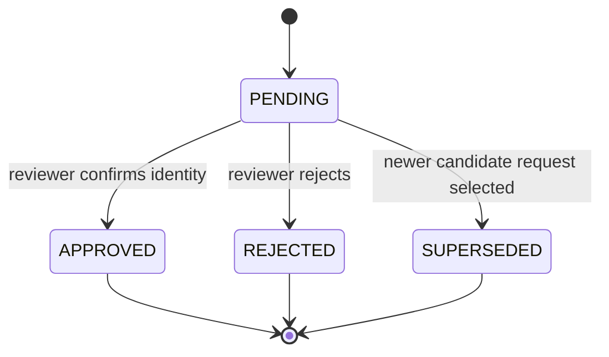
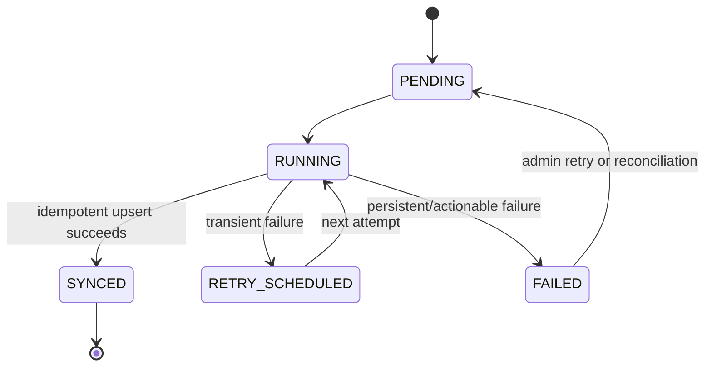

# State Machines

## Purpose

These state machines make lifecycle rules explicit so the UI, API, database, background jobs, and tests share the same behavior. Transitions are backend-controlled, authorized, validated against current state, and audited where indicated.

## Attendance session

`DRAFT` represents the PRD's `DRAFT / CONFIGURING`. A separate `REOPENED` persisted state is not required; reopening can transition the same session back to `OPEN` while preserving a reopen event and count.

### Transition rules

| From | Command | To | Actor | Rules |
| --- | --- | --- | --- | --- |
| None | Create draft | DRAFT | Course Rep/Admin | Start/end must become valid before opening |
| DRAFT | Schedule | SCHEDULED | Course Rep/Admin | Future effective start; no retroactive check-ins |
| DRAFT | Open | OPEN | Course Rep/Admin | End after start; no other effective/open session |
| SCHEDULED | Activate | OPEN | System/authorized workflow | Current server time reaches valid start |
| DRAFT/SCHEDULED | Cancel | CANCELLED | Course Rep/Admin | Explicit reason; audit required |
| OPEN | Close | CLOSED | Course Rep/Admin/System | Automatic closure records `SYSTEM` |
| OPEN | Extend end | OPEN | Course Rep/Admin | Future end on same local day; Course Rep capped at two hours beyond original end; audit required |
| OPEN | Cancel | CANCELLED | Course Rep/Admin | Explicit reason; excluded from denominator |
| CLOSED | Reopen | OPEN | Admin only | Reason and new future closing time required; same session ID; audit required |
| CLOSED | Cancel | CANCELLED | Admin only | Explicit invalidation and audit |

### Session invariants

- Only `OPEN` and currently effective sessions accept check-ins.
- Scheduled sessions do not accept attendance before their effective start.
- A newly configured session defaults to a three-hour duration; interfaces always display the resolved local start and end clock times.
- At most one session may be effective/open for the initial course.
- Reopening continues the same session ID and does not weaken attendance uniqueness.
- A Course Representative can never reopen a closed session. Isolated missed attendance is corrected individually by an Administrator rather than reopening the session.
- Warn the Course Representative shortly before automatic close so an allowed extension can be made while the session is still open.
- Closed sessions reject new automatic attendance. Administrator historical correction is a separate action.
- Cancelled sessions never contribute to attendance denominators.
- A Wednesday without a session has no attendance state and creates no absence.

## Automatic attendance evaluation

An attendance attempt is evaluated in a deterministic backend pipeline:

### Attempt outcomes

| Outcome | Final attendance created? | Participant-facing behavior |
| --- | --- | --- |
| `PASS` | Yes, method `QR` | Show confirmed check-in time |
| `DUPLICATE` | No new row; existing row returned | Show already checked in and original time |
| `LOCATION_UNCERTAIN` | No | Auto-create one pending manual case; offer retry and case status |
| `LOCATION_PERMISSION_DENIED` | No | Explain permission recovery; explicit manual request is available |
| `LOCATION_TIMEOUT` / `LOCATION_UNAVAILABLE` / `LOCATION_UNSUPPORTED` | No | Offer retry; explicit manual request is available |
| `CLEARLY_REMOTE` | No | Explain venue requirement; explicit manual request is available if physically present |
| `DEVICE_CHANGE_REQUIRED` | No | Allow request for device replacement |
| `SESSION_NOT_OPEN` | No | Neutral not-open message |
| `SESSION_CLOSED` | No | Explain that the session ended |
| `AUTHENTICATION_REQUIRED` | No | Login, preserving check-in return intent |
| `NOT_A_PARTICIPANT` | No | Safe denial; do not expose attendance internals |

`PASS` is not complete until the database transaction commits. Google Sheets status does not alter the participant outcome.

## Final attendance and absence

The ordinary final record is `PRESENT`, with method `QR` or `MANUAL`. A second final present record for the same participant/session is impossible by database constraint.

Absence is derived or finalized only when:

- The session is `CLOSED`.
- The session is not `CANCELLED`.
- The session falls on or after the participant roster entry's `enrollmentEffectiveDate`.
- No final present record exists.

Sessions before the participant roster entry's `enrollmentEffectiveDate` are `NOT_APPLICABLE`, displayed as `N/A`, and excluded from the denominator. Historical correction updates current authoritative state and must preserve before/after values, actor, reason, and timestamp in `AuditEvent`; there is no separate attendance-version table. Records must not be silently deleted to represent a correction.

## Manual verification case

Rules:

- Approval is safe to submit more than once; subsequent submissions return the final state.
- Approval creates or returns the unique attendance record with method `MANUAL`.
- The reviewer sees the protected photo, name, serial, reason, and attempt time.
- Course Representatives cannot approve themselves through a bypass path.
- Emergency manual attendance requires an eligible current session and a reason.
- Only `LOCATION_UNCERTAIN` automatically creates a case, deduplicated per participant/session while pending.
- Clearly remote and denied/unavailable/no-fix outcomes create a case only after the participant explicitly requests it.
- Inactive-session, duplicate-attendance, and unrecognized-device outcomes never create a manual case.
- At session close plus 15 minutes, unresolved cases expire. Only an Administrator historical correction can address attendance afterward.

## Roster entry

Claiming is atomic with participant account creation. A duplicate or disputed claim does not create another account and routes to Administrator review. Restore returns an entry to its prior claim state without changing claim ownership. Corrections and disables preserve audit history. The exceptional first-claim pilot mode requires explicit configuration and Administrator review of every claim.

## Identification-photo change request

Only an Administrator can decide a photo-change request. Approval activates the candidate photo version, preserves auditable history, and schedules superseded content for policy-based deletion.

## Device change request

Approval transaction:

1. Lock or otherwise protect the participant's current device/request state.
2. Verify the reviewer may act and is not performing forbidden self-approval.
3. Revoke the previous active device.
4. Activate the candidate device.
5. Mark the request approved.
6. Append the audit event.

Exactly one active device remains after commit.

## Role assignment

- Granting `COURSE_REP` to a new participant revokes the previous active assignment in the same consistency boundary.
- Granting or revoking `ADMIN` is Administrator-only and should require recent re-authentication.
- Revoking `ADMIN` is rejected if it would leave zero active Administrators.
- Role changes are effective immediately and audited.

## Google Sheets synchronization job

Jobs use stable source keys. Repeating a job must produce one logical Sheet row/cell result. A worker outage or Google failure never changes a committed attendance record.

The worker uses the PostgreSQL-backed queue and retries immediately, after a few seconds, then at approximately 1, 5, and 15 minutes, followed by 30–60 minute intervals with jitter. Persistent failures become visible to Administrators and can be retried or reconciled safely.
